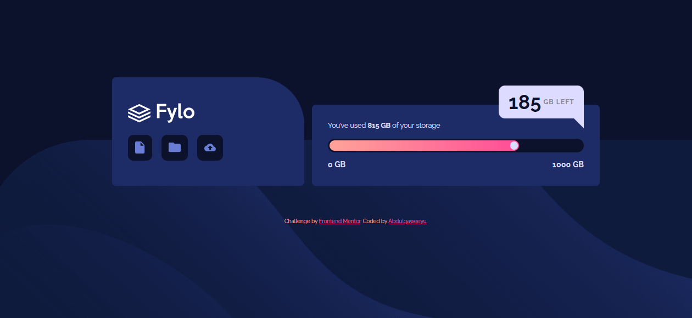
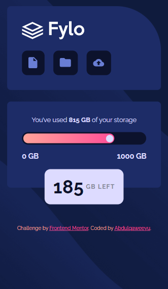

# Frontend Mentor - Fylo data storage component solution

This is a solution to the [Fylo data storage component challenge on Frontend Mentor](https://www.frontendmentor.io/challenges/fylo-data-storage-component-1dZPRbV5n). Frontend Mentor challenges help you improve your coding skills by building realistic projects. 

## Table of contents

- [Overview](#overview)
  - [The challenge](#the-challenge)
  - [Screenshot](#screenshot)
  - [Links](#links)
- [My process](#my-process)
  - [Built with](#built-with)
  - [What I learned](#what-i-learned)
  - [Useful resources](#useful-resources)
- [Author](#author)


## Overview

### The challenge

Users should be able to:

- View the optimal layout for the site depending on their device's screen size

### Screenshot





### Links

- Solution URL: [Solution Link](https://github.com/ABQ4539/Fylo-data-storage)
- Live Site URL: [Live Site Link](https://abq4539.github.io/Fylo-data-storage/)

## My process

### Built with

- Semantic HTML5 markup
- CSS custom properties
- Flexbox
- Mobile-first workflow
- Responsive Web Design


### What I learned

I learnt a lot during this challenge like properties and values such as `white-space: nowrap;`, `background-image: linear-gradient(90deg, red, blue);` and understanding the positioning properties like:

```css
.container {
  position: relative;
  left: 20%;
  top: 50%
}
```

### Useful resources

- [Stackoverflow Flexbox explanation](https://stackoverflow.com/questions/58244731/how-to-move-items-in-flexbox) - This helped me arrange and positiion my page with flexbox.


## Author

- Frontend Mentor - [@ABQ4539](https://www.frontendmentor.io/profile/ABQ4539)


